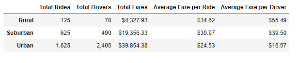
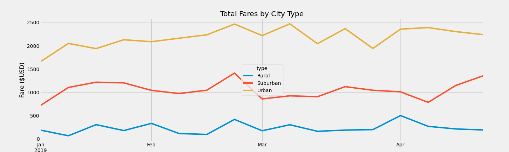

# PyBer Analysis

## Overview of the Analysis
PyBer is a ride-sharing app company that is looking to improve access to ride-sharing services and determine affordability for underserved neighborhoods. A large amount of city and ride data have been gathered. City data includes the number of drivers per city and the type of city (urban, suburban, or rural). Ride data includes a unique ride ID for each ride that occurs; as well as, the city, date, and fare amount for each ride. Data analysis will be performed on the city and ride data to help PyBer's goal of improving access to ride-sharing services and determine affordability for underserved neighborhoods.

## Results

The Urban city type had the largest number of Total Rides, Total Drivers, and Total Fares; followed by the Suburban city type and then the Rural city type.

The Urban Total Rides is approximately 2.6 times and 13 times more than the Suburban and Rural city types, respectively. 
The Urban Total Drivers is approximately 5 times and 31 times more than the Suburban and Rural city types, respectively. 
The Urban Total Fares is approximately 2 times and 9 times more than the Suburban and Rural city types, respectively. 

This trend is reversed for the Average Fare per Ride and Average Fare per Driver. The Rural city type had the greatest Average Fare per Ride and Average Fare per Driver; followed by the Suburban city type and then Rural city type. 

The Urban city type is the only city type where the Average Fare per Ride was more than the Average Fare per Driver (approximately 48% more).
The Suburban city type's Average Fare per Ride was approximately 28% less than the Average Fare per Driver.
The Rural city type's Average Fare per Ride was approximately 60% less than the Average Fare per Driver.

The Urban Average Fare per Ride is approximately 26% and 41% less than the Suburban and Rural city types, respectively.
The Urban Average Fare per Driver is approximately 138% and 235% less than the Suburban and Rural city types, respectively.

The Urban city type is the only city type that has more drivers than Total Rides. 

The Total Fares by City Type was narrowed down to the months of January to April 2019. The multiple-line chart during this timeframe shows that the data is consistent with the PyBer Summary dataframe. The Urban city type had the largest number of Total Fares; followed by the Suburban city type and then the Rural city type. The Total Fares during this timeframe does not vary drastically. One trend to note is that towards the end of February 2019, there was a peak for all three city types. 

## Summary
Three businesses recommendations to the CEO for addressing any disparities among the city types:
- The Urban city type has a significantly large number of Total Drivers (2,405 drivers to 1,625 rides). There are more drivers than there are rides. The Urban city type has a significantly smaller Average Fare per Driver than the other city types. Drivers in this city type probably do not make as much money since there is more competition and not enough rides. A recommendation is to reduce the number of drivers in Urban areas to increase the Average Fare per Driver. 
- The Suburban city type seem to be a good city type to focus on. The Average Fare per Driver is more than, but still comparable with, the Average Fare per Ride. A recommendation to increase the number of drivers may result in an increase of Total Rides due to accessibility.
- The Rural city type has the highest Average Fare per Ride. In order to improve affordability in underserved neighborhoods, one recommendation is the decrease the fare rate per mile. By decreasing the Average Fare per Ride, it may incline more rides in Rural areas. 

